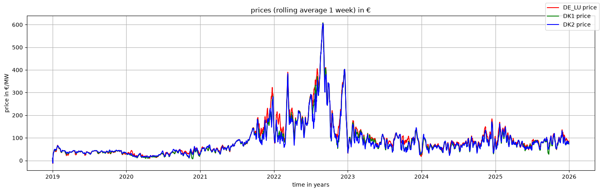
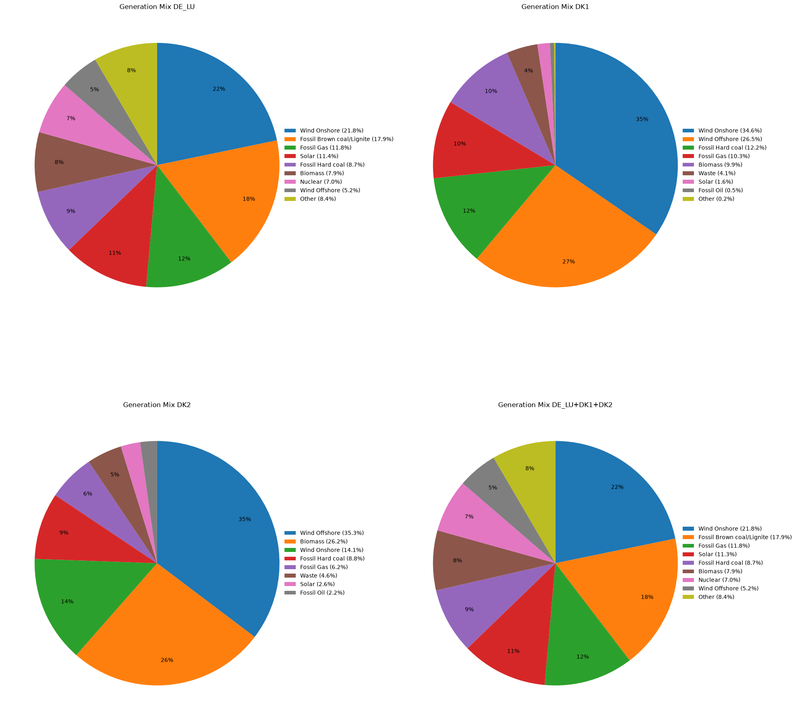

# Energy Market Analysis Project (WIP) - by Paul J. Hermes

Exploring how different aspects in the European electricity market relate to each other with the goal to predict day-ahead prices. 

Using the generation mix, weather and calendar data, I hope to predict the day-ahead prices for electricity in the bidding zones DK1, DK2 and DE_LU.
The modelling of this data is done both using statistical methods and machine learning methods.

## Prerequisites

  - conda (I used version 26.1.1)
  - API Key for the ENTSO-E Transparency Platform
  - API Key for the Copernicus Climate Data Store

## Setup

After acquiring the needed prerequisites execute the following commands in your terminal:
    
    conda env create -f environment.lock.yml
    conda activate eu-energy-market
    cp .env.example .env

At this point open your favourite editor and place your own API keys in the dedicated fields of the .env file.
Then run:
    
    jupyter lab

### (Updating the Environment)

In case you want to use more current versions of the here used packages, you can perform the following commands to update the environment.
It is possible this makes the packages not work together anymore. 
If you use the setup I descibed above you will be using _exactly_ what I am using which should work without bigger problems.
ONLY PERFORM IF YOU KNOW WHAT YOU ARE DOING:

    conda env update -f environment.yml --prune
    conda env export --no-builds > environment.lock.yml

## Contents

    01_acquisition.ipynb          - How to get the data I will be using
    02_preprocessing.ipynb        - Cleaning up the data
    03_eda.ipynb                  - Exploration of the data
    04_statistical_methods.ipynb  - Autoregression and timeseries approaches (WIP)
    05_ml_models.ipynb            - Machine learning approaches (WIP)

## Results

(WIP)

## Attribution

This project uses data from the ENTSO-E Transparency Platform and contains modified Copernicus Climate Change Service information (ERA5 hourly data), accessed September 2026. Neither the European Commission nor ECMWF is responsible for any use of the Copernicus information or data contained herein.
